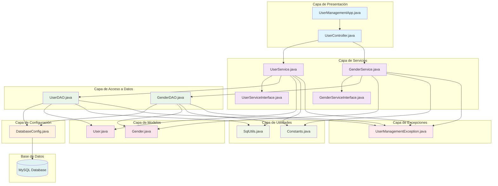
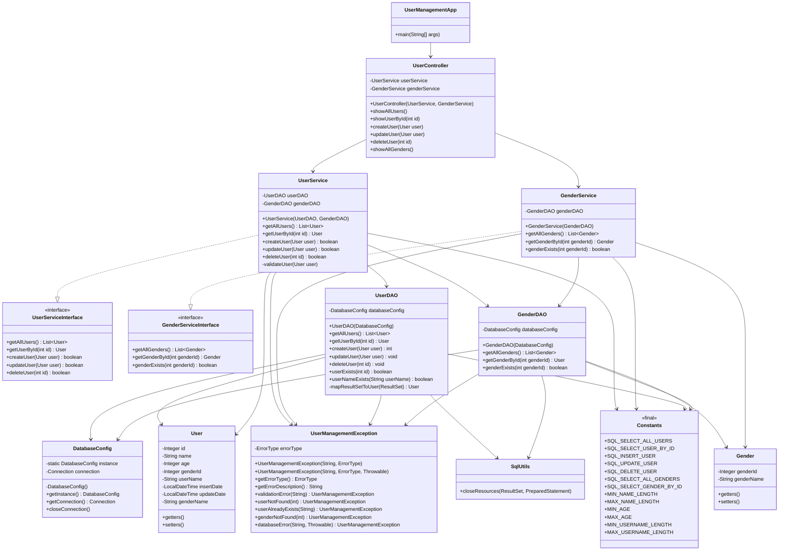
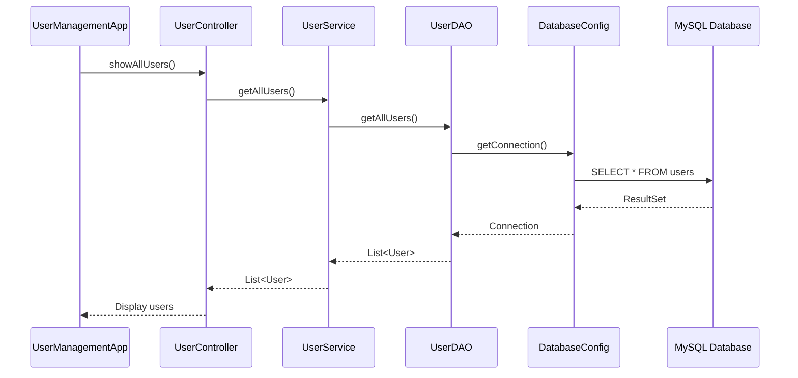

# Diagrama de Arquitectura - Sistema de Gestión de Usuarios

## Arquitectura General

El proyecto sigue una arquitectura en capas (Layered Architecture) con separación clara de responsabilidades y principios SOLID.



## Diagrama de Clases Detallado



## Patrones de Diseño Utilizados

### 1. **Patrón Singleton**
- **Clase**: `DatabaseConfig`
- **Propósito**: Garantizar una única instancia de conexión a la base de datos

### 2. **Patrón DAO (Data Access Object)**
- **Clases**: `UserDAO`, `GenderDAO`
- **Propósito**: Separar la lógica de acceso a datos de la lógica de negocio

### 3. **Patrón MVC (Model-View-Controller)**
- **Model**: `User`, `Gender`
- **View**: `UserManagementApp` (consola)
- **Controller**: `UserController`

### 4. **Inyección de Dependencias**
- **Implementación**: Constructor injection
- **Beneficio**: Desacoplamiento y testabilidad

### 5. **Patrón Strategy (Interfaces)**
- **Interfaces**: `UserServiceInterface`, `GenderServiceInterface`
- **Propósito**: Permitir diferentes implementaciones de servicios

## Flujo de Datos



## Características de la Arquitectura

### ✅ **Principios SOLID Aplicados**
- **S**: Single Responsibility Principle - Cada clase tiene una responsabilidad específica
- **O**: Open/Closed Principle - Extensible a través de interfaces
- **L**: Liskov Substitution Principle - Las interfaces permiten sustitución
- **I**: Interface Segregation Principle - Interfaces específicas para cada servicio
- **D**: Dependency Inversion Principle - Dependencias a través de abstracciones

### ✅ **Clean Code**
- Nombres descriptivos y significativos
- Métodos pequeños y con una sola responsabilidad
- Comentarios JavaDoc completos
- Manejo centralizado de excepciones

### ✅ **Buenas Prácticas**
- Separación de capas clara
- Reutilización de conexiones a base de datos
- Constantes centralizadas
- Manejo de recursos con try-with-resources
- Validaciones en la capa de servicio

### ✅ **Manejo de Errores**
- Excepción personalizada `UserManagementException`
- Tipos de error específicos
- Mensajes descriptivos
- Propagación adecuada de errores

## Estructura de Paquetes

```
com.usermanagement/
├── config/          # Configuración de base de datos
├── controller/      # Controladores (Capa de presentación)
├── dao/            # Data Access Objects
├── exception/      # Excepciones personalizadas
├── model/          # Entidades/Modelos
├── service/        # Lógica de negocio
└── util/           # Utilidades y constantes
```

Esta arquitectura proporciona:
- **Mantenibilidad**: Código organizado y fácil de modificar
- **Escalabilidad**: Fácil agregar nuevas funcionalidades
- **Testabilidad**: Componentes desacoplados y con interfaces
- **Reutilización**: Componentes modulares y reutilizables 